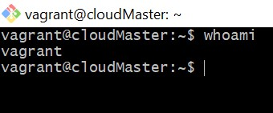
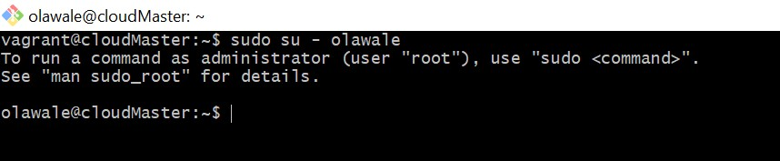

# AltSchool Cloud-Engineering Exercise 2

## Exercise 2

### Task

- Research online for 10 more linux commands aside the ones already mentioned in this module. Submit using your altschool-cloud-exercises project, explaining what each command is used for with examples of how to use each and example screenshots of using each of them.

### Instruction

- [ ] Submit your work in a folder for this exercise in your altschool-cloud-exercises project. You will need to learn how to embed images in markdown files.

- 1. The whatis command provides a brief description of command line programs. The description gets sourced from the man page of each command. If you ran whatis cat, you’d see there is a small blurb with a short description. View 

- 2. The alias command. If you need to type a long command many times, an alias can help reduce the stress. View 

- 3. the ncal command highlights today's date in the output.View 

- 4. The df command displays the amount of disk space available on the filesystem with each file name's argument.View 

- 5. The tty command of terminal basically prints the file name of the terminal connected to standard input.
View 

- 6. free displays the total amount of free and used physical and swap memory in the system, as well as the buffers and caches used by the kernel. View 

- 7. The date command shows the current date. View 

- 8. The whoami command prints the current effective id. View 

- 9. The su command, stands for 'substitute user', is used by a computer user to execute commands with the privileges of another user account. View 

- 10. View 
 