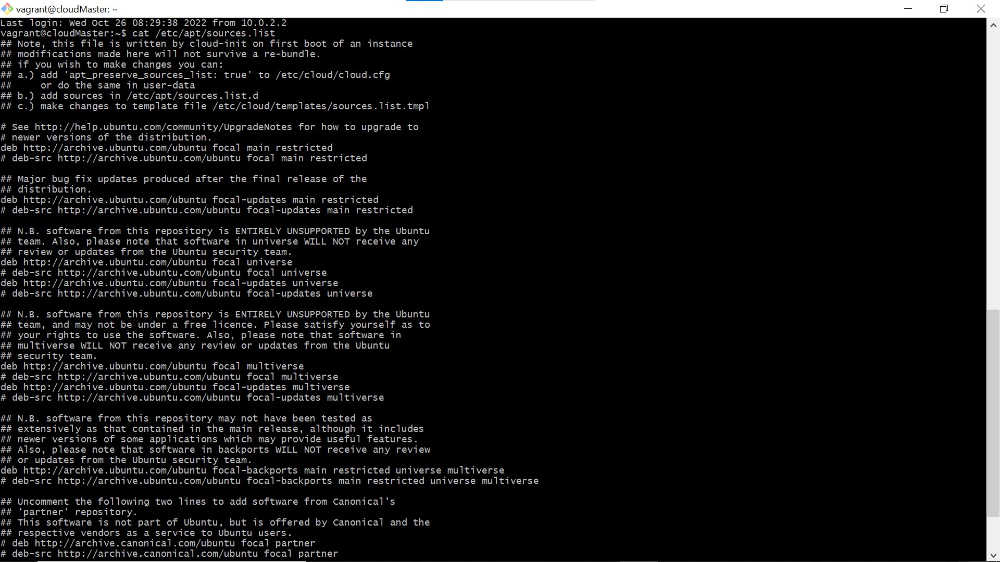
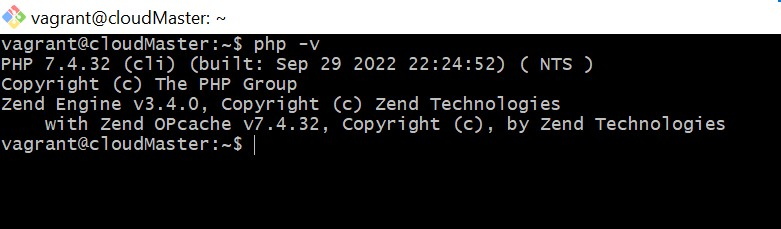

# AltSchool Cloud-Engineering Exercise 4

## Exercise 4

### Task

* Install PHP 7.4 on your local linux machine using the ppa:ondrej/php package repo.

### Instruction

* [ ] Learn how to use the add-apt-repository command

* [ ] Submit the content of /etc/apt/sources.list and the output of php -v command

/etc/apt/sources.list

php -v command

