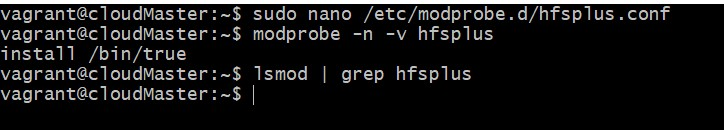

# AltSchool Cloud-Engineering Exercise 6

## Exercise 6

### Task

* Review the CIS benchmark for ubuntu, and try to implement at least 10 of the recommendations that we made within the benchmark.

### Instruction

* N/A

* 1. Ensure mounting of cramfs filesystems is disabled
        The cramfs filesystem type is a compressed read-only Linux filesystem embedded in small footprint systems. A cramfs image can be used without having to first decompress the image.
        

* 2. Ensure mounting of hfsplus filesystems is disabled
        The hfsplus filesystem type is a hierarchical filesystem designed to replace hfs that allows you to mount Mac OS filesystems. Removing support for unneeded filesystem types reduces the local attack surface of the system. If this filesystem type is not needed, disable it.
        

* 3. Ensure mounting of squashfs filesystems is disabled
        The squashfs filesystem type is a compressed read-only Linux filesystem embedded in small footprint systems (similar to cramfs ). A squashfs image can be used without having to first decompress the image. Removing support for unneeded filesystem types reduces the local attack surface of the system. If this filesystem type is not needed, disable it.
        
